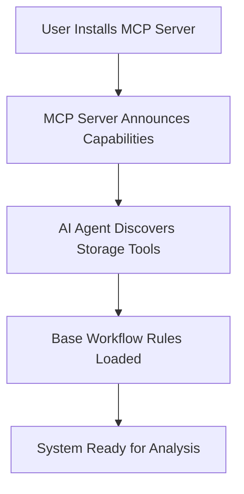
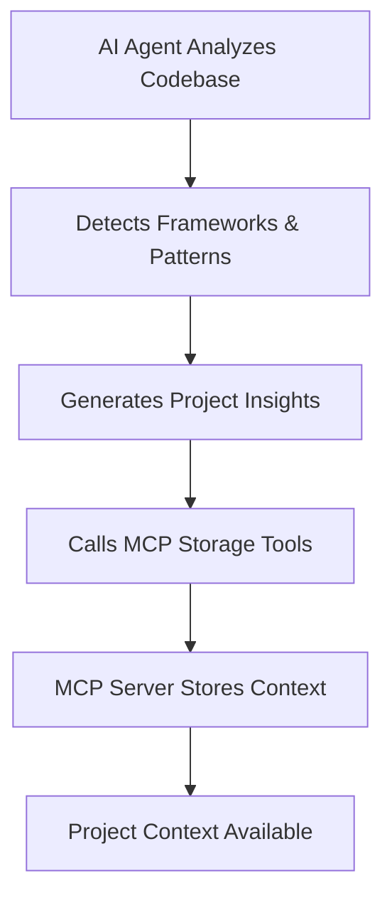
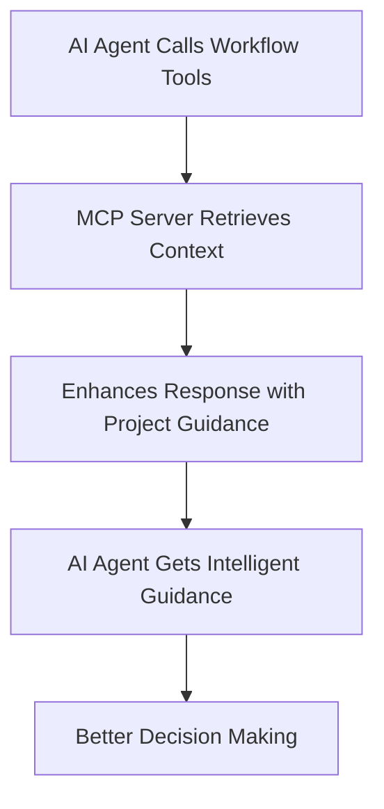

# Project Onboarding System: AI Agent-Driven Collaborative Intelligence

## Overview

The **Project Onboarding System** is a revolutionary collaborative intelligence approach where AI agents (like Cursor) perform codebase analysis and use MCP storage tools to save project insights, while the MCP server provides enhanced workflow guidance based on the stored project context.

## Core Concept: Collaborative Intelligence Model

Instead of the MCP server doing complex codebase analysis, the system leverages the natural strengths of both components:

### **AI Agent Responsibilities (Cursor, etc.):**

1. **Codebase Analysis** - Uses natural file access and language processing
2. **Pattern Detection** - Identifies architectural patterns and code conventions
3. **Context Generation** - Creates project insights and behavioral recommendations
4. **MCP Tool Calls** - Stores analysis results using MCP storage tools

### **MCP Server Responsibilities:**

1. **Data Storage** - Stores project context in structured database format
2. **Workflow Enhancement** - Enhances all MCP responses with project-aware guidance
3. **Behavioral Intelligence** - Provides role-specific guidance based on stored context
4. **Rule Integration** - Combines stored project context with workflow rules

## System Architecture

### **Phase 1: Initial Setup & Discovery**



### **Phase 2: AI Agent-Driven Analysis**



### **Phase 3: Enhanced Workflow Intelligence**



## MCP Storage Tools (AI Agent → MCP Server)

### **1. store_project_overview**

```typescript
interface StoreProjectOverviewRequest {
  currentSystemInfo: string; // windows with power shell,
  projectPath: string;
  projectType: string; // "NestJS Application", "React App", etc.
  frameworks: string[]; // ["NestJS", "Prisma", "TypeScript"]
  languages: string[]; // ["TypeScript", "JavaScript"]
  architecturalStyle: string; // "Domain-Driven Design", "Layered Architecture"
  summary: string; // High-level project description
  buildSystem: string[]; // ["npm", "webpack", "jest"]
  testingFrameworks: string[]; // ["Jest", "Supertest"]
}

// Usage Example:
store_project_overview({
  projectPath: '/workspace/my-project',
  projectType: 'NestJS Workflow Management System',
  frameworks: ['NestJS', 'Prisma', 'TypeScript'],
  languages: ['TypeScript'],
  architecturalStyle: 'Domain-Driven Design with Clean Architecture',
  summary: 'Modular workflow management system with MCP integration',
  buildSystem: ['npm', 'webpack', 'jest'],
  testingFrameworks: ['Jest', 'Supertest'],
});
```

### **2. store_architectural_analysis**

```typescript
interface StoreArchitecturalAnalysisRequest {
  projectPath: string;
  patterns: string[]; // ["Repository Pattern", "Service Layer"]
  moduleStructure: object; // Directory organization analysis
  dataAccessStrategy: string; // "Prisma ORM with Repository Pattern"
  apiDesign: string; // "RESTful with OpenAPI documentation"
  dependencyInjection: object; // DI container and patterns
  serviceInterfaces: object; // Service contracts and boundaries
  integrationPoints: object; // External service integrations
}

// Usage Example:
store_architectural_analysis({
  projectPath: '/workspace/my-project',
  patterns: ['Repository Pattern', 'Service Layer', 'Dependency Injection'],
  moduleStructure: {
    'src/domains/': 'Domain-specific modules',
    'src/task-workflow/': 'Core workflow functionality',
    'prisma/': 'Database schema and migrations',
  },
  dataAccessStrategy: 'Prisma ORM with Repository Pattern',
  apiDesign: 'RESTful APIs with OpenAPI documentation',
  dependencyInjection: {
    container: 'NestJS built-in DI',
    patterns: ['Constructor Injection', 'Interface-based DI'],
  },
});
```

### **3. store_code_patterns**

```typescript
interface StoreCodePatternsRequest {
  projectPath: string;
  designPatterns: object; // Detected design patterns with examples
  codingConventions: object; // Naming, structure, style guidelines
  errorHandling: object; // Error handling approaches
  validation: object; // Input validation patterns
  testing: object; // Testing patterns and conventions
  security: object; // Security implementation patterns
}

// Usage Example:
store_code_patterns({
  projectPath: '/workspace/my-project',
  designPatterns: {
    'Repository Pattern': {
      description: 'Data access abstraction',
      examples: ['src/repositories/', 'UserRepository.ts'],
      usage: 'All database operations go through repositories',
    },
    'Service Layer': {
      description: 'Business logic encapsulation',
      examples: ['src/services/', 'TaskService.ts'],
      usage: 'Controllers delegate to services for business logic',
    },
  },
  codingConventions: {
    naming: 'camelCase for variables, PascalCase for classes',
    fileStructure: 'Feature-based modules with index exports',
    imports: 'Absolute imports using path mapping',
  },
  errorHandling: {
    approach: 'Exception filters with structured error responses',
    patterns: ['HttpException', 'Custom exception classes'],
  },
});
```

### **4. store_role_behavioral_context**

```typescript
interface StoreRoleBehavioralContextRequest {
  projectPath: string;
  roleType: string; // "senior-developer", "architect", etc.
  codeQualityStandards: object; // Quality requirements for this role
  testingApproach: object; // Testing expectations
  patterns: string[]; // Patterns this role should follow
  bestPractices: object; // Role-specific best practices
  commonPitfalls: object; // What to avoid
  toolsAndFrameworks: object; // Relevant tools for this role
  qualityChecklist: object; // Quality validation items
}

// Usage Example:
store_role_behavioral_context({
  projectPath: '/workspace/my-project',
  roleType: 'senior-developer',
  codeQualityStandards: {
    principles: ['SOLID', 'DRY', 'KISS'],
    typescript: 'Strict mode enabled, comprehensive typing',
    linting: 'ESLint + Prettier configuration',
  },
  testingApproach: {
    coverage: '80% minimum coverage with Jest',
    types: ['Unit tests', 'Integration tests with Supertest'],
    patterns: ['AAA pattern', 'Test factories for data setup'],
  },
  patterns: ['Repository Pattern', 'Service Layer', 'Dependency Injection'],
  bestPractices: {
    'Code Organization': 'Feature-based modules with clear boundaries',
    'Error Handling': 'Use exception filters and structured responses',
    'Database Access': 'Always use repositories, never direct ORM calls',
  },
});
```

### **5. update_project_context**

```typescript
interface UpdateProjectContextRequest {
  projectPath: string;
  contextType: 'overview' | 'architecture' | 'patterns' | 'role-context';
  updates: object; // Partial updates to existing context
  reason: string; // Why the update is needed
}

// Usage Example:
update_project_context({
  projectPath: '/workspace/my-project',
  contextType: 'patterns',
  updates: {
    designPatterns: {
      'Factory Pattern': {
        description: 'Object creation abstraction',
        examples: ['src/factories/TaskFactory.ts'],
        usage: 'Use for complex object creation logic',
      },
    },
  },
  reason: 'Added new Factory pattern for task creation',
});
```

## Enhanced Workflow Tools (MCP Server → AI Agent)

All existing workflow tools are enhanced with stored project context:

### **Enhanced task_operations Response**

```typescript
// AI Agent calls existing tool
task_operations({
  operation: "create",
  taskData: {
    name: "Implement Authentication",
    description: "Add JWT authentication system"
  }
})

// MCP Server response enhanced with project context
{
  success: true,
  data: {
    taskId: "TSK-123",
    name: "Implement Authentication",
    status: "not-started"
  },
  workflowGuidance: {
    nextSteps: [
      "Review existing authentication patterns in src/auth/",
      "Follow Repository Pattern for user data access",
      "Use NestJS Guards for route protection",
      "Implement JWT strategy with Passport.js"
    ],
    behavioralContext: {
      codeQuality: "Apply SOLID principles, use TypeScript strict mode",
      patterns: "Follow established Repository and Service Layer patterns",
      testing: "80% coverage with Jest, integration tests with Supertest",
      architecture: "Maintain Domain-Driven Design module boundaries"
    },
    projectSpecific: {
      existingPatterns: ["Repository Pattern", "Service Layer", "DI Container"],
      integrationPoints: ["UserRepository", "AuthService", "JwtModule"],
      qualityStandards: "ESLint + Prettier, comprehensive TypeScript typing"
    },
    qualityChecklist: [
      "Implement UserRepository following existing pattern",
      "Create AuthService with proper error handling",
      "Add comprehensive Jest unit tests",
      "Ensure integration with existing RBAC system"
    ]
  }
}
```

## Database Schema (Simplified)

### **ProjectContext (Master Record)**

```typescript
{
  id: number,
  projectPath: string,           // Root path of the project
  lastUpdated: DateTime,
  updatedBy: string,             // AI agent identifier

  // Stored Analysis Results
  projectOverview: object,       // From store_project_overview
  architecturalAnalysis: object, // From store_architectural_analysis
  codePatterns: object,          // From store_code_patterns
  roleBehavioralContexts: object // From store_role_behavioral_context
}
```

## Implementation Benefits

### **1. Leverages AI Agent Strengths**

- ✅ Natural codebase access and traversal
- ✅ Advanced language processing for code analysis
- ✅ Pattern recognition and insight generation
- ✅ No need to duplicate AI capabilities in MCP server

### **2. Simplified MCP Server**

- ✅ Focused responsibility: storage and workflow enhancement
- ✅ No complex AI integration or codebase scanning
- ✅ Lightweight, fast, and reliable
- ✅ Easy to maintain and extend

### **3. Collaborative Intelligence**

- ✅ AI agent does analysis, MCP server provides guidance
- ✅ Best of both worlds: AI insight + structured workflow
- ✅ Seamless integration between components
- ✅ Scalable to any AI agent with MCP support

### **4. Enhanced Workflow Intelligence**

- ✅ Every MCP response includes project-aware guidance
- ✅ Role-specific behavioral context based on actual project
- ✅ Pattern-aware recommendations and quality standards
- ✅ Eliminates need for manual memory bank files

## Usage Workflow

### **Initial Project Setup**

1. **AI Agent discovers MCP capabilities**

   ```typescript
   // MCP server announces available tools
   available_tools: [
     'store_project_overview',
     'store_architectural_analysis',
     'store_code_patterns',
     'store_role_behavioral_context',
     'task_operations', // Enhanced with context
     'planning_operations', // Enhanced with context
     // ... other workflow tools
   ];
   ```

2. **AI Agent analyzes project and stores context**

   ```typescript
   // AI agent performs analysis and stores results
   await store_project_overview({...});
   await store_architectural_analysis({...});
   await store_code_patterns({...});
   await store_role_behavioral_context("senior-developer", {...});
   await store_role_behavioral_context("architect", {...});
   ```

3. **Enhanced workflow tools become available**
   ```typescript
   // All subsequent workflow tool calls include project-aware guidance
   const result = await task_operations({...});
   // result.workflowGuidance contains project-specific guidance
   ```

### **Ongoing Development**

- **AI Agent calls workflow tools** for task management
- **MCP Server enhances responses** with stored project context
- **AI Agent gets intelligent guidance** based on actual project patterns
- **Context can be updated** as project evolves

This collaborative approach creates a truly intelligent workflow system that combines the natural strengths of AI agents with the structured guidance capabilities of MCP servers, resulting in better development outcomes with minimal setup overhead.
