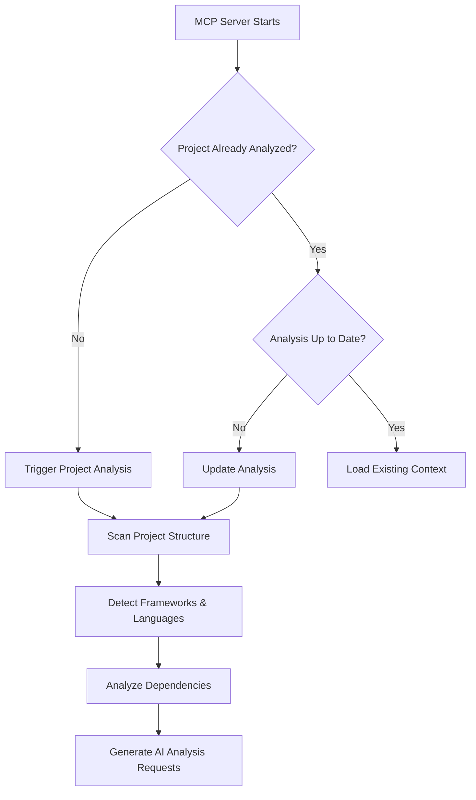
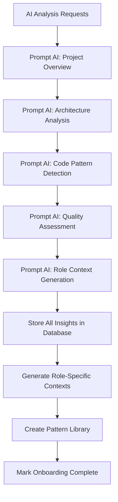
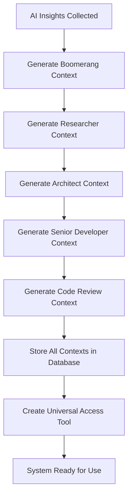

# Project Onboarding System: AI-Driven Intelligent Context Generation

## Overview

The **Project Onboarding System** is a revolutionary approach to workflow intelligence that automatically analyzes any project when the MCP server starts for the first time, generates comprehensive project insights using AI assistance, and creates role-specific behavioral context that eliminates the need for manual memory bank files.

## Core Concept

Instead of requiring manual creation of memory bank files (ProjectOverview.md, TechnicalArchitecture.md, etc.), the system:

1. **Automatically analyzes** the project structure, codebase, and patterns
2. **Prompts AI agents** to generate comprehensive project insights
3. **Creates role-specific contexts** with behavioral guidance and quality standards
4. **Stores everything in the database** for instant access by any role
5. **Provides universal access** through the `get_project_context` MCP tool
   "subtaskId": 16,
   "updateData": {
   "name": "Create AI Agent Project Context Management Tools",
   "description": "Create AI agent management tools for project context (analyze_project, update_project_context, refresh_project_analysis, generate_role_context, update_project_patterns). These tools allow Cursor and other AI clients to trigger project analysis, update context areas, and manage the intelligent project onboarding system. The actual project context will be embedded automatically in all rule-aware MCP responses."
   }

## System Architecture

### Database Schema Components

#### 1. ProjectOnboarding (Master Record)

```typescript
{
  id: number,
  projectPath: string,           // Root path of the project
  onboardingStatus: OnboardingStatus,
  analysisVersion: string,       // Version of analysis algorithm
  lastAnalyzed: DateTime,
  analysisTriggeredBy: string,   // Who/what triggered analysis

  // Related entities
  projectAnalysis: ProjectAnalysisResult,
  codebaseInsights: CodebaseInsights,
  architecturalProfile: ArchitecturalProfile,
  roleContexts: RoleProjectContext[],
  generatedPatterns: GeneratedPattern[],
  analysisRequests: AnalysisRequest[]
}
```

#### 2. ProjectAnalysisResult (Technical Analysis)

```typescript
{
  // Project Characteristics
  projectType: ProjectType,
  frameworkDetected: string[],      // ["NestJS", "React", "Prisma"]
  languagesDetected: string[],      // ["TypeScript", "JavaScript"]
  buildSystemDetected: string[],    // ["npm", "webpack", "jest"]
  testingFrameworks: string[],      // ["Jest", "Supertest"]

  // Architecture Analysis
  moduleStructure: object,          // Directory structure analysis
  dependencyGraph: object,          // Internal/external dependencies
  serviceInterfaces: object,        // API endpoints, service contracts
  dataAccessPatterns: object,       // Database, ORM patterns

  // Quality Metrics
  codeQualityMetrics: object,       // Linting, formatting, complexity
  testCoverage: object,             // Test coverage analysis
  documentationState: object,       // README, docs, comments
  securityPatterns: object,         // Security implementations

  // Integration Points
  externalServices: object,         // Third-party integrations
  deploymentConfig: object,         // Docker, CI/CD patterns
  environmentConfig: object         // Environment variables, configs
}
```

#### 3. CodebaseInsights (Pattern Analysis)

```typescript
{
  // Code Pattern Analysis
  designPatterns: object,           // Detected design patterns
  codingConventions: object,        // Naming, structure, style
  errorHandlingPatterns: object,    // Error handling approaches
  validationPatterns: object,       // Input validation patterns

  // Technical Debt Analysis
  technicalDebtAreas: object,       // Areas needing improvement
  codeSmells: object,               // Detected code smells
  refactoringOpportunities: object, // Suggested improvements
  performanceBottlenecks: object,   // Performance issues

  // Development Workflow
  gitWorkflow: object,              // Branch strategy, commits
  cicdPipeline: object,             // CI/CD setup
  developmentTools: object          // IDE configs, tools
}
```

#### 4. ArchitecturalProfile (System Design)

```typescript
{
  // Architectural Decisions
  architecturalStyle: string,       // "Modular Monolith", "Microservices"
  layeringStrategy: object,         // Layer organization
  dependencyInjection: object,      // DI patterns and containers
  dataAccessStrategy: object,       // Repository, Active Record, etc.

  // Communication Patterns
  apiDesignPatterns: object,        // REST, GraphQL, RPC
  eventHandling: object,            // Event-driven patterns
  messagingPatterns: object,        // Pub/sub, queues

  // Quality Attributes
  scalabilityApproach: object,      // How system scales
  securityImplementation: object,   // Security patterns
  performanceStrategy: object,      // Caching, optimization
  reliabilityPatterns: object       // Error handling, resilience
}
```

#### 5. RoleProjectContext (Role-Specific Intelligence)

```typescript
{
  roleType: RoleType,               // "senior-developer", "architect", etc.

  // Role-Specific Context
  contextSummary: string,           // High-level summary for role
  keyResponsibilities: object,      // What this role focuses on
  relevantPatterns: object,         // Patterns this role should follow
  qualityChecklist: object,         // Quality items to verify

  // Behavioral Guidance
  approachGuidance: object,         // How this role approaches tasks
  toolsAndFrameworks: object,       // Relevant tools for this role
  commonPitfalls: object,           // What this role should avoid
  bestPractices: object,            // Role-specific best practices

  // Project-Specific Adaptations
  projectSpecificGuidance: object, // Adaptations for this project
  integrationPoints: object        // How role integrates with project
}
```

## Automated Onboarding Workflow

### Phase 1: Project Detection & Initial Analysis



### Phase 2: AI-Powered Analysis



### Phase 3: Context Generation & Storage



## Universal get_project_context MCP Tool

### Tool Interface

```typescript
interface GetProjectContextRequest {
  roleType?: RoleType; // Optional: get role-specific context
  contextType?: ContextType; // "overview" | "technical" | "behavioral" | "patterns"
  taskSpecific?: {
    taskId: string;
    focusAreas: string[]; // Specific areas of interest
  };
  includePatterns?: boolean; // Include detected patterns
  includeInsights?: boolean; // Include codebase insights
  includeArchitecture?: boolean; // Include architectural profile
}

interface GetProjectContextResponse {
  success: boolean;
  data: {
    projectOverview: {
      projectType: ProjectType;
      frameworks: string[];
      languages: string[];
      architecturalStyle: string;
      summary: string;
    };

    roleContext?: {
      roleType: RoleType;
      contextSummary: string;
      keyResponsibilities: object;
      approachGuidance: object;
      qualityChecklist: object;
      bestPractices: object;
      projectSpecificGuidance: object;
    };

    technicalContext?: {
      moduleStructure: object;
      serviceInterfaces: object;
      dataAccessPatterns: object;
      integrationPoints: object;
    };

    patterns?: GeneratedPattern[];
    insights?: CodebaseInsights;
    architecture?: ArchitecturalProfile;
  };
  workflowGuidance?: {
    nextSteps: string[];
    contextualAdvice: string[];
    qualityGates: string[];
  };
}
```

### Usage Examples

#### 1. Senior Developer Getting Project Context

```typescript
// Senior developer starting a new task
const context = await get_project_context({
  roleType: 'senior-developer',
  contextType: 'behavioral',
  includePatterns: true,
  taskSpecific: {
    taskId: 'TSK-123',
    focusAreas: ['authentication', 'data-access'],
  },
});

// Response includes:
// - SOLID principles enforcement for this project
// - Existing authentication patterns to follow
// - Data access patterns (Repository vs Active Record)
// - Quality checklist specific to this codebase
// - Integration points and service interfaces
```

#### 2. Architect Getting Comprehensive Analysis

```typescript
// Architect designing new features
const context = await get_project_context({
  roleType: 'architect',
  contextType: 'technical',
  includeArchitecture: true,
  includeInsights: true,
});

// Response includes:
// - Complete architectural profile
// - Existing design patterns and rationale
// - Technical debt areas to consider
// - Scalability and performance patterns
// - Integration constraints and opportunities
```

#### 3. Any Role Getting Quick Overview

```typescript
// Any role needing project overview
const context = await get_project_context({
  contextType: 'overview',
});

// Response includes:
// - Project type and technology stack
// - High-level architecture summary
// - Key patterns and conventions
// - Integration points and external services
```

## AI Analysis Prompts & Requests

### 1. Initial Project Analysis Prompt

```
Analyze this project structure and provide comprehensive insights:

PROJECT STRUCTURE:
{directory_tree}

PACKAGE.JSON:
{package_json_content}

README:
{readme_content}

Please provide:
1. Project type classification (monorepo, microservices, single app, etc.)
2. Technology stack analysis with versions
3. Architectural style identification
4. Module organization patterns
5. Development workflow assessment
6. Quality and testing approach
7. Integration patterns and external dependencies
8. Potential technical debt areas
9. Scalability and performance considerations
10. Security implementation patterns

Format response as structured JSON for database storage.
```

### 2. Role-Specific Context Generation Prompt

```
Based on this project analysis, generate role-specific behavioral context for {roleType}:

PROJECT ANALYSIS:
{project_analysis_result}

CODEBASE INSIGHTS:
{codebase_insights}

ARCHITECTURAL PROFILE:
{architectural_profile}

For the {roleType} role, provide:
1. Key responsibilities in this specific project context
2. Approach guidance (how to tackle tasks in this codebase)
3. Quality checklist items specific to this project's patterns
4. Best practices that align with existing code conventions
5. Common pitfalls to avoid based on current technical debt
6. Tools and frameworks most relevant to this role
7. Integration points this role should be aware of
8. Project-specific adaptations from general role guidelines

Focus on actionable, specific guidance that helps this role work effectively within this project's established patterns and constraints.
```

### 3. Pattern Extraction Prompt

```
Extract and document the key patterns used in this codebase:

CODE SAMPLES:
{representative_code_samples}

ARCHITECTURE ANALYSIS:
{architectural_profile}

For each pattern found, provide:
1. Pattern name and type (architectural, code style, testing, etc.)
2. Description of how it's implemented in this codebase
3. Code examples showing the pattern in use
4. Rationale for why this pattern is used here
5. When and where this pattern should be applied
6. Which roles should be most aware of this pattern
7. How this pattern affects code quality and maintainability
8. Related patterns and dependencies

Focus on patterns that are consistently used and should be followed by new code.
```

## Integration with Existing Workflow

### Enhanced MCP Tool Responses

All existing MCP tools will be enhanced to include project-aware guidance:

```typescript
// Example: Enhanced task_operations response
{
  success: true,
  data: {
    taskId: "TSK-123",
    name: "Implement Authentication",
    status: "not-started",
    // ... existing fields
  },
  workflowGuidance: {
    nextSteps: [
      "Review existing authentication patterns in src/auth/",
      "Follow established JWT implementation pattern",
      "Use existing UserService interface for user management",
      "Implement tests following existing test structure in __tests__/"
    ],
    contextualAdvice: [
      "This project uses Passport.js with JWT strategy",
      "Follow the Repository pattern established in src/repositories/",
      "Use class-validator decorators for input validation",
      "Ensure integration with existing RBAC system"
    ],
    qualityGates: [
      "Unit tests with 80%+ coverage using Jest",
      "Integration tests for authentication flow",
      "Security validation for JWT implementation",
      "Performance testing for token validation"
    ],
    projectContext: {
      relevantFiles: ["src/auth/", "src/users/", "src/common/guards/"],
      existingPatterns: ["JWT Strategy", "Repository Pattern", "Guard Pattern"],
      integrationPoints: ["UserService", "RoleService", "DatabaseModule"]
    }
  }
}
```

### Elimination of Memory Bank Dependency

The Project Onboarding System completely eliminates the need for:

- ❌ `memory-bank/ProjectOverview.md`
- ❌ `memory-bank/TechnicalArchitecture.md`
- ❌ `memory-bank/DeveloperGuide.md`

Instead, all this information is:

- ✅ **Automatically generated** through AI analysis
- ✅ **Stored in the database** for fast access
- ✅ **Accessible to any role** through the universal tool
- ✅ **Always up-to-date** with automatic refresh capabilities
- ✅ **Project-specific** and contextually relevant

## Benefits & Advantages

### 1. **Zero Manual Setup**

- No need to create memory bank files manually
- Automatic project analysis on first MCP server start
- Self-bootstrapping system that works with any project

### 2. **Universal Role Access**

- Any role can access project context instantly
- No knowledge bottlenecks between roles
- Consistent project understanding across all workflow participants

### 3. **AI-Enhanced Intelligence**

- Leverages AI to generate comprehensive project insights
- Continuously improving analysis through AI model updates
- Context-aware recommendations based on actual codebase analysis

### 4. **Dynamic & Up-to-Date**

- Project context can be refreshed when significant changes occur
- Version tracking for analysis improvements
- Automatic detection of project evolution

### 5. **Role-Specific Behavioral Context**

- Each role gets tailored guidance for the specific project
- Behavioral patterns adapted to project characteristics
- Quality standards aligned with existing codebase patterns

### 6. **Pattern-Aware Development**

- Automatic detection and documentation of existing patterns
- Guidance on when and how to apply patterns
- Prevention of pattern violations and architectural drift

## Implementation Timeline

### Batch 5: Project Onboarding System (RULES-B005)

1. **Design Project Onboarding Database Schema** (Subtask 14)

   - Implement all onboarding-related models
   - Set up proper relationships and indexing
   - Create migration scripts

2. **Create AI-Powered Project Analysis Service** (Subtask 15)

   - Build ProjectAnalysisService with AI integration
   - Implement automatic project structure scanning
   - Create AI prompt generation and response processing

3. **Implement Universal get_project_context MCP Tool** (Subtask 16)

   - Create the universal MCP tool interface
   - Implement role-specific context retrieval
   - Add task-specific context filtering

4. **Build Automated Project Onboarding Workflow** (Subtask 17)

   - Implement startup-triggered analysis workflow
   - Create AI interaction orchestration
   - Add progress tracking and error handling

5. **Create Role-Specific Context Generation Engine** (Subtask 18)
   - Build intelligent context generation algorithms
   - Implement behavioral guidance creation
   - Create pattern-aware quality checklist generation

## Future Enhancements

### 1. **Continuous Learning**

- Learn from successful workflow executions
- Improve context generation based on outcomes
- Adapt recommendations based on project evolution

### 2. **Cross-Project Intelligence**

- Share patterns and insights across similar projects
- Build knowledge base of successful implementations
- Provide comparative analysis and recommendations

### 3. **Real-Time Updates**

- Monitor codebase changes for context updates
- Trigger re-analysis when significant changes detected
- Maintain context freshness automatically

### 4. **Advanced AI Integration**

- Use specialized AI models for different analysis types
- Implement multi-modal analysis (code + documentation + tests)
- Add predictive insights for potential issues

This Project Onboarding System represents the ultimate evolution of our workflow intelligence - a self-bootstrapping, AI-enhanced system that provides every role with the exact project context they need, when they need it, without any manual setup or maintenance overhead.
