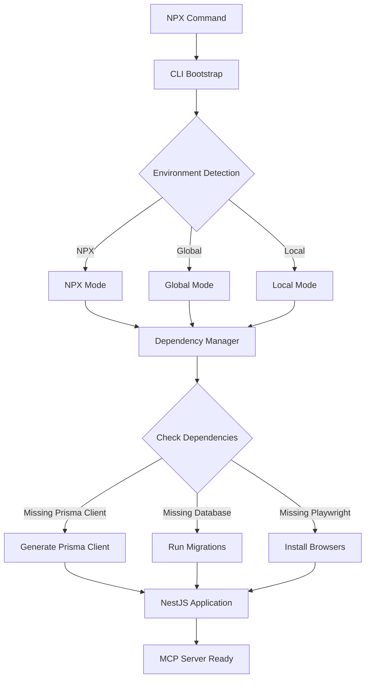

# Technical Architecture

## 1. Modern Architecture Overview

The MCP Workflow Manager is now built on NestJS, Prisma, and @rekog/mcp-nest, replacing the legacy file-system-based approach. This enables modularity, scalability, and maintainability with self-contained NPX package distribution.

### Key Components

- **NestJS**: Application structure, DI, modules, and service orchestration
- **Prisma**: ORM, schema migrations, and type-safe DB access
- **@rekog/mcp-nest**: MCP tool/resource exposure via decorators and Zod validation
- **Zod**: Parameter validation for all tools
- **CLI Dependency Manager**: Automatic dependency management for NPX distribution
- **Environment-Aware Initialization**: Adapts behavior for NPX, global, and local installations

### NPX Package Architecture

The NPX package includes a sophisticated dependency management system that ensures self-contained operation:



**Dependency Management Components:**

- **DependencyManager Class**: Centralized dependency detection and management
- **Environment Detection**: Identifies NPX vs global vs local installation context
- **Automatic Prisma Setup**: Generates client and runs migrations on first run
- **Conditional Playwright**: Installs browsers only when report generation needed
- **Graceful Degradation**: Disables optional features if dependencies unavailable

### High-Level Architecture Diagram

```mermaid
graph TD
    A[Client/Cursor IDE] <-->|MCP Transport (HTTP+SSE, Stdio, etc.)| B(NestJS Application)
    B --> C{Request Handling Layer (Controllers/Gateways)}
    C --> D{Application/Business Logic Layer (Services/Providers)}
    D --> E{MCP Tool/Resource Layer (@rekog/mcp-nest)}
    E --> F[PrismaService (Data Access)]
    F <--> G[(Database)]
    D --> F

    subgraph NestJS Application
        direction LR
        B1[AppModule]
        B2[Feature Modules (e.g., TaskWorkflowModule)]
        B3[PrismaModule]
        B4[McpModule (@rekog/mcp-nest)]
        B1 --> B2
        B1 --> B3
        B1 --> B4
        B2 -.-> D
        B3 -.-> F
        B4 -.-> E
    end
```

### Feature Module Structure (Example: TaskWorkflowModule)

Feature modules like `TaskWorkflowModule` are internally organized using a Domain-Driven Design (DDD) inspired approach. Files are grouped by domain/feature (e.g., `crud`, `query`, `state`, `interaction`, `plan`, `reporting`) under a `domains` directory within the module (`src/task-workflow/domains/`).

Each domain typically contains:

- **MCP Operation Services**: Expose tools using `@rekog/mcp-nest`. These services orchestrate calls to business logic services.
  (e.g., `TaskCrudOperationsService.ts` in `src/task-workflow/domains/crud/`)
- **Business Logic Services**: Contain the core business logic, interacting with Prisma or other services.
  (e.g., `TaskCrudService.ts` in `src/task-workflow/domains/crud/`)
- **Schemas (Zod)**: Define the structure and validation for MCP tool parameters and potentially internal data structures, typically in a `schemas` sub-directory within the domain.
  (e.g., `create-task.schema.ts` in `src/task-workflow/domains/crud/schemas/`)

This structure replaces a flatter organization where services, MCP operations, and schemas might have been grouped by technical type (e.g., all services in one folder, all schemas in another).

### Enhanced MCP Tools Architecture (Latest Updates)

**Status**: ✅ **ENHANCED WITH INDIVIDUAL SUBTASK OPERATIONS & PERFORMANCE MONITORING** (Completed 2025-06-07)

The MCP tools have been significantly enhanced with individual subtask operations and performance monitoring capabilities:

#### **Enhanced Tool Suite (11 Total Tools)**

**Core Workflow Domain (6 tools):**

- **`task_operations`** - Enhanced task lifecycle with codebase analysis and evidence tracking
- **`planning_operations`** - Implementation planning with strategic guidance and batch management
- **`individual_subtask_operations`** - **NEW**: Individual subtask management with evidence collection, dependency tracking, and strategic guidance
- **`workflow_operations`** - Role-based delegation with enhanced context preservation and strategic escalation
- **`review_operations`** - Code review and completion reporting with comprehensive evidence tracking
- **`research_operations`** - Research reports with evidence-based findings and strategic recommendations

**Query Optimization Domain (3 tools):**

- **`query_task_context`** - Comprehensive context retrieval with **two-layer performance caching** (25-75% token savings)
- **`query_workflow_status`** - Delegation and workflow status queries with role-specific filtering
- **`query_reports`** - Report queries with evidence relationships and comprehensive filtering

**Batch Operations Domain (2 tools):**

- **`batch_subtask_operations`** - Enhanced bulk subtask management with progress tracking and evidence collection
- **`batch_status_updates`** - Cross-entity status synchronization with data consistency validation

#### **Performance Monitoring & Caching Architecture**

**Two-Layer Caching System:**

```typescript
// Layer 1: MCP Response Cache - Complete tool responses
interface MCPResponseCache {
  key: string; // Generated from tool name + parameters
  response: any; // Complete MCP tool response
  ttl: number; // Time-to-live in seconds
  tokenEstimate: number; // Estimated token count for savings tracking
}

// Layer 2: Database Query Cache - Prisma query results
interface DatabaseQueryCache {
  key: string; // Generated from query + parameters
  data: any; // Prisma query results
  ttl: number; // Time-to-live in seconds
  relationships: string[]; // Related entities for invalidation
}
```

**Performance Services:**

- **`PerformanceMonitorService`**: STDIO-compatible file-based logging for performance metrics
- **`MCPCacheService`**: Two-layer caching with LRU eviction and memory management
- **`@MCPPerformance` Decorator**: Automatic performance monitoring and caching integration

**Cache Strategy by Tool:**

- **High-frequency tools** (query_task_context): 5-minute TTL, aggressive caching
- **Medium-frequency tools** (task_operations get): 2-minute TTL, selective caching
- **Low-frequency tools** (workflow_operations): 30-second TTL, minimal caching
- **Write operations**: Cache invalidation patterns for related entities

**Performance Benefits:**

- **Token Savings**: 25-75% reduction in token usage through intelligent caching
- **Response Times**: Sub-50ms for cached operations vs 150ms+ for uncached
- **Memory Management**: LRU eviction with configurable memory limits
- **STDIO Compatibility**: File-based logging that doesn't interfere with MCP protocol

#### **Individual Subtask Operations Enhancement**

**New Capabilities:**

- **Evidence Collection**: Comprehensive completion evidence with file modifications, testing results, and quality metrics
- **Dependency Tracking**: Automatic dependency validation and resolution for complex workflows
- **Strategic Guidance**: Architectural patterns, implementation approaches, and quality requirements per subtask
- **Technical Specifications**: Framework requirements, testing specifications, and acceptance criteria
- **Automatic Dependency Resolution**: Get next available subtask based on dependency completion

**Enhanced Subtask Lifecycle:**

```typescript
interface EnhancedSubtask {
  // Core fields
  name: string;
  description: string;
  batchId: string;
  sequenceNumber: number;

  // Enhanced fields
  strategicGuidance: {
    architecturalPattern: string;
    implementationApproach: string;
    performanceConsiderations: string;
    qualityRequirements: string;
  };

  technicalSpecifications: {
    frameworks: string[];
    patterns: string[];
    testingRequirements: string;
  };

  acceptanceCriteria: string[];
  dependencies: string[];
  estimatedDuration: string;

  // Evidence collection
  completionEvidence: {
    implementationSummary: string;
    filesModified: string[];
    duration: string;
    acceptanceCriteriaVerification: Record<string, string>;
    testingResults: {
      unitTests: string;
      integrationTests: string;
      manualTesting: string;
    };
    qualityAssurance: {
      codeQuality: string;
      performance: string;
      security: string;
    };
    strategicGuidanceFollowed: string;
  };
}
```

### Advanced Reporting Architecture (Feature-Based Organization)

**Status**: ✅ **FULLY RE-ARCHITECTED** (Completed 2025-06-05)

The reporting system has been completely re-architected using feature-based organization principles:

#### **Current Technology Stack (Updated)**

- **Server-Side**: NestJS + TypeScript + Prisma ORM
- **HTML Generation**: Direct TypeScript string interpolation (no template engines)
- **Client-Side**: Vanilla JavaScript with Chart.js visualizations
- **Styling**: Tailwind CSS via CDN with custom CSS classes
- **Fonts**: Google Fonts (Inter) + Font Awesome icons
- **Interactivity**: Native JavaScript DOM manipulation and event handling
- **Charts**: Chart.js for data visualization
- **Security**: HTML escaping utilities built into generators

#### **Feature-Based Structure**

```
/src/task-workflow/domains/reporting/
  /shared/                           # 4 Core Shared Services (KISS Principle)
    - report-data.service.ts         # Centralized Prisma queries (200 lines max)
    - report-transform.service.ts    # Data formatting and Chart.js preparation
    - report-render.service.ts       # HTML compilation coordination (NO HANDLEBARS)
    - report-metadata.service.ts     # Common metadata generation
    /types/                          # TypeScript interfaces and types
      - report-data.types.ts, interfaces.ts

  /workflow-analytics/               # Business Domain: Workflow Analysis
    /delegation-flow/
      - delegation-flow.service.ts   # Main service (150 lines)
      - delegation-analytics.service.ts  # Analytics calculations
      - delegation-summary.service.ts    # Summary generation
    /role-performance/
      - role-performance.service.ts
      - role-analytics.service.ts
      - role-metrics-calculator.service.ts
    /workflow-analytics/
      - workflow-analytics.service.ts
      - workflow-analytics-calculator.service.ts
      - workflow-summary.service.ts

  /task-management/                  # Business Domain: Task Management
    /task-detail/
      - task-detail.service.ts
      - task-detail-builder.service.ts
      - task-progress-analyzer.service.ts
      - task-quality-analyzer.service.ts
      /view/                         # Enhanced view generators
        - task-detail-header-view.service.ts
        - task-detail-content-view.service.ts
        - task-detail-analysis-view.service.ts
        - task-detail-generator.service.ts (coordinator)
        - task-detail-view.module.ts
    /implementation-plan/
      - implementation-plan.service.ts
      - implementation-plan-builder.service.ts
      - implementation-plan-analyzer.service.ts
      - implementation-plan-generator.service.ts  # NEEDS REFACTORING (290 lines)

  /dashboard/                        # Business Domain: Dashboard Reports
    /interactive-dashboard/
      - interactive-dashboard.service.ts
      - dashboard-data-aggregator.service.ts
      - dashboard-chart-builder.service.ts
      - interactive-dashboard-generator.service.ts (coordinator, 84 lines)
      /view/                         # Focused view generators (SRP applied)
        - html-head.generator.ts     # HTML head with CDN resources
        - header.generator.ts        # Page header
        - metrics-cards.generator.ts # Metric cards with hover effects
        - charts.generator.ts        # Chart.js integration
        - tasks-list.generator.ts    # Task cards and lists
        - delegations-table.generator.ts # Delegation tables
        - quick-actions.generator.ts # Action buttons
        - footer.generator.ts        # Page footer
        - scripts.generator.ts       # Vanilla JavaScript (663 lines)
        - interactive-dashboard-view.module.ts
```

#### **Key Architectural Improvements**

1. **No Template Engines**: Direct TypeScript string interpolation for HTML generation
2. **Vanilla JavaScript**: Native DOM manipulation without framework dependencies
3. **Service Complexity Reduction**: All services now under 200 lines following KISS principle
4. **Focused Generators**: Single Responsibility Principle applied to view generators
5. **CDN-Based Assets**: Tailwind CSS, Chart.js, Font Awesome via CDN for zero build complexity
6. **Type-Safe HTML Generation**: TypeScript interfaces for all data structures

#### **HTML Generation Pattern (Replaces Handlebars)**

**Current Approach (No Template Engine Required):**

```typescript
// Direct TypeScript string interpolation
generateSection(data: TypeSafeData): string {
  return `
    <div class="bg-white rounded-xl shadow-lg p-6">
        <h2 class="text-xl font-semibold">${this.escapeHtml(data.title)}</h2>
        ${data.items.map(item => `
            <div class="flex items-center space-x-4">
                <span>${this.escapeHtml(item.name)}</span>
            </div>
        `).join('')}
    </div>`;
}
```

**Enhanced Security:**

- Built-in HTML escaping utilities in all generators
- No client-side template execution
- Direct data interpolation prevents injection attacks

#### **Client-Side Architecture (No Alpine.js)**

**Current Approach (Vanilla JavaScript):**

```typescript
// Generated JavaScript with direct data interpolation
generateScripts(data: ReportData): string {
  return `
    <script>
        // Direct data embedding (no window.data dependencies)
        function initializeCharts() {
            const chartData = ${JSON.stringify(data.chartData)};
            new Chart(ctx, chartConfig);
        }

        // Native event handling
        document.addEventListener('DOMContentLoaded', initializeDashboard);
    </script>`;
}
```

**Interactivity Features:**

- Chart.js for data visualization
- Native DOM manipulation for filtering and search
- CSS transitions and hover effects
- Intersection Observer for scroll animations
- Event delegation for table interactions

#### **Enhanced UI/UX Standards**

**Design System:**

- **Tailwind CSS**: Utility-first styling via CDN
- **Custom CSS Classes**: Defined in html-head.generator.ts for consistent design
- **Google Fonts**: Inter font family for modern typography
- **Font Awesome**: Icon library for consistent iconography
- **Gradient Text**: CSS gradients for metric values and highlights
- **Hover Effects**: Transform and shadow animations
- **Responsive Design**: Mobile-first responsive grid layouts

**Visual Enhancements:**

- Card-based layout with rounded corners and shadows
- Gradient text for metric values
- Status badges with color coding
- Hover animations with scale and shadow effects
- Progress bars with animated transitions
- Interactive filtering with fade animations

### Workflow & Data Flow

- MCP client (Cursor IDE) sends requests via stdio or HTTP+SSE
- @rekog/mcp-nest receives, validates, and routes to the correct tool method
- Tool methods are implemented in NestJS services, using Prisma for DB access
- All tool parameters are validated with Zod
- Results are returned to the client via MCP

### MCP Schema-Database Alignment

**Status**: ✅ **FULLY ALIGNED** (Completed 2025-05-23)

### Reports System Re-Architecture

**Status**: ✅ **FULLY RE-ARCHITECTED** (Completed 2025-06-05)

- **42 schema files** across 5 domains fully aligned with Prisma database models
- **10 core models** properly mapped: Task, TaskDescription, ImplementationPlan, Subtask, DelegationRecord, ResearchReport, CodeReview, CompletionReport, Comment, WorkflowTransition
- **P0 blocking issues resolved**: CodeReview schema ID type mismatch fixed, Subtask operations functional
- **Domain coverage**: CORE (100%), TASK (100%), QUERY (100%), WORKFLOW (100%), INTERACTION (100%)
- **Type safety**: Complete TypeScript alignment with database constraints
- **Performance**: Optimized query patterns and efficient field mapping implemented

**Migration Notes**:

- Template, SchemaVersion, MemoryBank, and Commit models planned for removal from database
- Focus maintained on 10 operational core models for active workflow management

### Updating the Architecture

- When adding or refactoring tools, update the architecture diagram and this file as needed
- Ensure all new tools/services follow the modular, DI-driven NestJS pattern
- See `DeveloperGuide.md` for implementation and best practices

## 2. Security & Deployment

- Use NestJS Guards for authentication/authorization
- Prisma prevents SQL injection by design
- Run Prisma migrations before production deployment
- Use environment variables for DB and sensitive config

## 3. Legacy Architecture (for reference)

See previous versions of this file for the legacy file-system-based approach.
