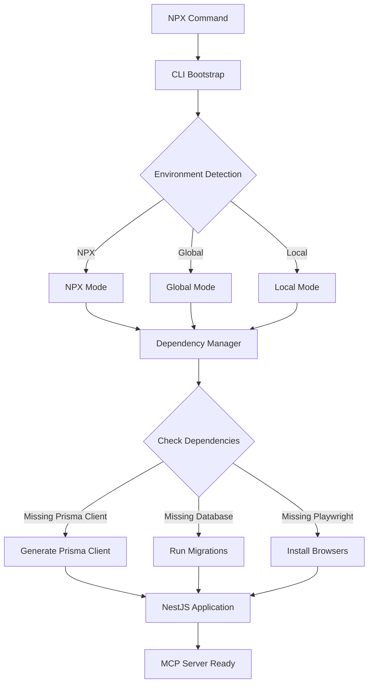

# Technical Architecture

## 1. Modern Architecture Overview

The MCP Workflow Manager is now built on NestJS, Prisma, and @rekog/mcp-nest, replacing the legacy file-system-based approach. This enables modularity, scalability, and maintainability with self-contained NPX package distribution.

### Key Components

- **NestJS**: Application structure, DI, modules, and service orchestration
- **Prisma**: ORM, schema migrations, and type-safe DB access
- **@rekog/mcp-nest**: MCP tool/resource exposure via decorators and Zod validation
- **Zod**: Parameter validation for all tools
- **CLI Dependency Manager**: Automatic dependency management for NPX distribution
- **Environment-Aware Initialization**: Adapts behavior for NPX, global, and local installations

### NPX Package Architecture

The NPX package includes a sophisticated dependency management system that ensures self-contained operation:



**Dependency Management Components:**

- **DependencyManager Class**: Centralized dependency detection and management
- **Environment Detection**: Identifies NPX vs global vs local installation context
- **Automatic Prisma Setup**: Generates client and runs migrations on first run
- **Conditional Playwright**: Installs browsers only when report generation needed
- **Graceful Degradation**: Disables optional features if dependencies unavailable

### High-Level Architecture Diagram

```mermaid
graph TD
    A[Client/Cursor IDE] <-->|MCP Transport (HTTP+SSE, Stdio, etc.)| B(NestJS Application)
    B --> C{Request Handling Layer (Controllers/Gateways)}
    C --> D{Application/Business Logic Layer (Services/Providers)}
    D --> E{MCP Tool/Resource Layer (@rekog/mcp-nest)}
    E --> F[PrismaService (Data Access)]
    F <--> G[(Database)]
    D --> F

    subgraph NestJS Application
        direction LR
        B1[AppModule]
        B2[Feature Modules (e.g., TaskWorkflowModule)]
        B3[PrismaModule]
        B4[McpModule (@rekog/mcp-nest)]
        B1 --> B2
        B1 --> B3
        B1 --> B4
        B2 -.-> D
        B3 -.-> F
        B4 -.-> E
    end
```

### Feature Module Structure (Example: TaskWorkflowModule)

Feature modules like `TaskWorkflowModule` are internally organized using a Domain-Driven Design (DDD) inspired approach. Files are grouped by domain/feature (e.g., `crud`, `query`, `state`, `interaction`, `plan`, `reporting`) under a `domains` directory within the module (`src/task-workflow/domains/`).

Each domain typically contains:

- **MCP Operation Services**: Expose tools using `@rekog/mcp-nest`. These services orchestrate calls to business logic services.
  (e.g., `TaskCrudOperationsService.ts` in `src/task-workflow/domains/crud/`)
- **Business Logic Services**: Contain the core business logic, interacting with Prisma or other services.
  (e.g., `TaskCrudService.ts` in `src/task-workflow/domains/crud/`)
- **Schemas (Zod)**: Define the structure and validation for MCP tool parameters and potentially internal data structures, typically in a `schemas` sub-directory within the domain.
  (e.g., `create-task.schema.ts` in `src/task-workflow/domains/crud/schemas/`)

This structure replaces a flatter organization where services, MCP operations, and schemas might have been grouped by technical type (e.g., all services in one folder, all schemas in another).

### Workflow & Data Flow

- MCP client (Cursor IDE) sends requests via stdio or HTTP+SSE
- @rekog/mcp-nest receives, validates, and routes to the correct tool method
- Tool methods are implemented in NestJS services, using Prisma for DB access
- All tool parameters are validated with Zod
- Results are returned to the client via MCP

### MCP Schema-Database Alignment

**Status**: ✅ **FULLY ALIGNED** (Completed 2025-05-23)

- **42 schema files** across 5 domains fully aligned with Prisma database models
- **10 core models** properly mapped: Task, TaskDescription, ImplementationPlan, Subtask, DelegationRecord, ResearchReport, CodeReview, CompletionReport, Comment, WorkflowTransition
- **P0 blocking issues resolved**: CodeReview schema ID type mismatch fixed, Subtask operations functional
- **Domain coverage**: CORE (100%), TASK (100%), QUERY (100%), WORKFLOW (100%), INTERACTION (100%)
- **Type safety**: Complete TypeScript alignment with database constraints
- **Performance**: Optimized query patterns and efficient field mapping implemented

**Migration Notes**:

- Template, SchemaVersion, MemoryBank, and Commit models planned for removal from database
- Focus maintained on 10 operational core models for active workflow management

### Updating the Architecture

- When adding or refactoring tools, update the architecture diagram and this file as needed
- Ensure all new tools/services follow the modular, DI-driven NestJS pattern
- See `DeveloperGuide.md` for implementation and best practices

## 2. Security & Deployment

- Use NestJS Guards for authentication/authorization
- Prisma prevents SQL injection by design
- Run Prisma migrations before production deployment
- Use environment variables for DB and sensitive config

## 3. Legacy Architecture (for reference)

See previous versions of this file for the legacy file-system-based approach.
